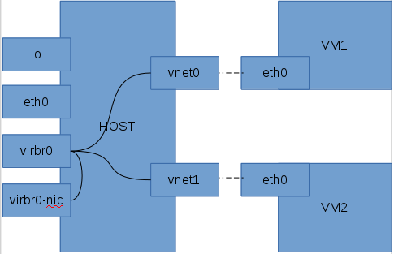
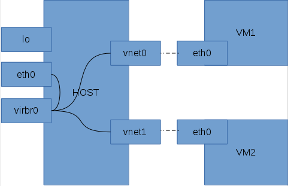

#虚拟机网络

##新建虚拟机（NAT）后生成的网络借口情况

```
eth0      Link encap:Ethernet  HWaddr 44:37:E6:4A:62:AD  
          inet6 addr: fe80::4637:e6ff:fe4a:62ad/64 Scope:Link
          UP BROADCAST RUNNING MULTICAST  MTU:1500  Metric:1
          RX packets:987782 errors:0 dropped:0 overruns:0 frame:0
          TX packets:84155 errors:0 dropped:0 overruns:0 carrier:0
          collisions:0 txqueuelen:1000
          RX bytes:109919111 (104.8 MiB)  TX bytes:12695454 (12.1 MiB)
          Interrupt:17

lo        Link encap:Local Loopback  
          inet addr:127.0.0.1  Mask:255.0.0.0
          inet6 addr: ::1/128 Scope:Host
          UP LOOPBACK RUNNING  MTU:16436  Metric:1
          RX packets:4 errors:0 dropped:0 overruns:0 frame:0
          TX packets:4 errors:0 dropped:0 overruns:0 carrier:0
          collisions:0 txqueuelen:0
          RX bytes:240 (240.0 b)  TX bytes:240 (240.0 b)

virbr0    Link encap:Ethernet  HWaddr 52:54:00:B9:B0:96  
          inet addr:192.168.122.1  Bcast:192.168.122.255  Mask:255.255.255.0
          UP BROADCAST RUNNING MULTICAST  MTU:1500  Metric:1
          RX packets:0 errors:0 dropped:0 overruns:0 frame:0
          TX packets:2126 errors:0 dropped:0 overruns:0 carrier:0
          collisions:0 txqueuelen:0
          RX bytes:0 (0.0 b)  TX bytes:100387 (98.0 KiB)

virbr0-nic Link encap:Ethernet  HWaddr 52:54:00:B9:B0:96  
          BROADCAST MULTICAST  MTU:1500  Metric:1
          RX packets:0 errors:0 dropped:0 overruns:0 frame:0
          TX packets:0 errors:0 dropped:0 overruns:0 carrier:0
          collisions:0 txqueuelen:500
          RX bytes:0 (0.0 b)  TX bytes:0 (0.0 b)
```

>说明：此新建的虚拟机为NAT转发的虚拟机

##虚拟机上网原理

1.  KVM虚拟机网络配置的两种方式：NAT方式和Bridge方式。

  + NAT方式：让虚拟机访问主机、互联网或本地网络上的资源的简单方法，但是不能从网络或其他的客户机访问客户机，性能上也需要大的调整。
  + Bridge方式：这种方式要比用户网络复杂一些，但是设置好后客户机与互联网，客户机与主机之间的通信都很容易。

2.  Nat方式的原理

  上述的网络接口中，virbr0是由宿主机虚拟机支持模块安装时产生的虚拟网络接口，也是一个switch和bridge，负责把内容分发到各虚拟机。
  NAT方式连接情况如下图所示：
  

  可以看出：虚拟接口和物理接口之间没有连接关系，所以虚拟机只能在通过虚拟的网络访问外部世界，无法从网络上定位和访问虚拟主机。
  `brctl show`可以查看当前的网桥及网桥的接口情况：
  ```
  # brctl show
bridge name     bridge id               STP enabled     interfaces
virbr0          8000.525400b9b096       yes             virbr0-nic
```
`route`命令可以查看当前网络转发的规则:
```
# route
Kernel IP routing table
Destination     Gateway         Genmask         Flags Metric Ref    Use Iface
192.168.122.0   *               255.255.255.0   U     0      0        0 virbr0
```
从输出可以看出，`virbr0`是一个桥接器，接收所有到网络192.168.122.*的内容。
虚拟机支持模块会修改iptables规则，通过命令可以查看：
```
# iptables -t nat -L -nv
Chain PREROUTING (policy ACCEPT 16924 packets, 2759K bytes)
pkts bytes target     prot opt in     out     source               destination
Chain POSTROUTING (policy ACCEPT 2009 packets, 125K bytes)
pkts bytes target     prot opt in     out     source               destination
 421 31847 MASQUERADE  all  --  *      *       192.168.122.0/24    !192.168.122.0/24   ----------->这条是关键，它配置了NAT功能。
Chain OUTPUT (policy ACCEPT 2011 packets, 125K bytes)
pkts bytes target     prot opt in     out     source               destination
```
```
# iptables -t filter -L -nv
Chain INPUT (policy ACCEPT 0 packets, 0 bytes)
pkts bytes target     prot opt in     out     source               destination
 1    74 ACCEPT     udp  --  virbr0 *       0.0.0.0/0            0.0.0.0/0           udp dpt:53    ---->由libvirt脚本自动写入
 0     0 ACCEPT     tcp  --  virbr0 *       0.0.0.0/0            0.0.0.0/0           tcp dpt:53    ---->由libvirt脚本自动写入
 3   984 ACCEPT     udp  --  virbr0 *       0.0.0.0/0            0.0.0.0/0           udp dpt:67    ---->由libvirt脚本自动写入
 0     0 ACCEPT     tcp  --  virbr0 *       0.0.0.0/0            0.0.0.0/0           tcp dpt:67    ---->由libvirt脚本自动写入
178K  195M ACCEPT     all  --  *      *       0.0.0.0/0            0.0.0.0/0           state RELATED,ESTABLISHED    ---->iptables的系统预设
 2   168 ACCEPT     icmp --  *      *       0.0.0.0/0            0.0.0.0/0                ---->iptables的系统预设
1148  216K ACCEPT     all  --  lo     *       0.0.0.0/0            0.0.0.0/0                ---->iptables的系统预设
 1    60 ACCEPT     tcp  --  *      *       0.0.0.0/0            0.0.0.0/0           state NEW tcp dpt:22  ---->iptables的系统预设
16564 2721K REJECT     all  --  *      *       0.0.0.0/0            0.0.0.0/0           reject-with icmp-host-prohibited ---->iptables的系统预设
Chain FORWARD (policy ACCEPT 0 packets, 0 bytes)
pkts bytes target     prot opt in     out     source               destination
3726 3485K ACCEPT     all  --  *      virbr0  0.0.0.0/0            192.168.122.0/24    state RELATED,ESTABLISHED  ---->由libvirt脚本自动写入
3491  399K ACCEPT     all  --  virbr0 *       192.168.122.0/24     0.0.0.0/0                ---->由libvirt脚本自动写入
 0     0 ACCEPT     all  --  virbr0 virbr0  0.0.0.0/0            0.0.0.0/0                ---->由libvirt脚本自动写入
 0     0 REJECT     all  --  *      virbr0  0.0.0.0/0            0.0.0.0/0           reject-with icmp-port-unreachable  ---->由libvirt脚本自动写入
 0     0 REJECT     all  --  virbr0 *       0.0.0.0/0            0.0.0.0/0           reject-with icmp-port-unreachable  ---->由libvirt脚本自动写入
 0     0 REJECT     all  --  *      *       0.0.0.0/0            0.0.0.0/0           reject-with icmp-host-prohibited  ---->iptables的系统预设
Chain OUTPUT (policy ACCEPT 181K packets, 138M bytes)
pkts bytes target     prot opt in     out     source               destination
```
启动虚拟机后，使用`brctl show` 查看网桥的连接情况：
```
# brctl show
bridge name     bridge id               STP enabled     interfaces
virbr0          8000.525400b9b096       yes             virbr0-nic
                                                                                 vnet0
```

3.  bridge连接方式原理

  Bridge方式即虚拟网桥的网络连接方式，是客户机和子网里面的机器能够互相通信。可以使虚拟机成为网络中具有独立IP的主机。

  桥接网络（也叫物理设备共享）被用作把一个物理设备复制到一台虚拟机。网桥多用作高级设置，特别是主机多个网络接口的情况。

  bridge方式连接情况如下图所示：

  

  网桥的基本原理就是创建一个桥接接口br0，在物理网卡和虚拟网络接口之间传递数据。

  桥接前网桥的情况：
  ```
  #brctl show
bridge name     bridge id               STP enabled     interfaces
br0             8000.4437e64a62ad       no              eth0
  ```

  桥接后网桥的情况
  ```
  # brctl show
bridge name     bridge id               STP enabled     interfaces
br0             8000.4437e64a62ad       no              eth0
                                                                              vnet0
  ```
